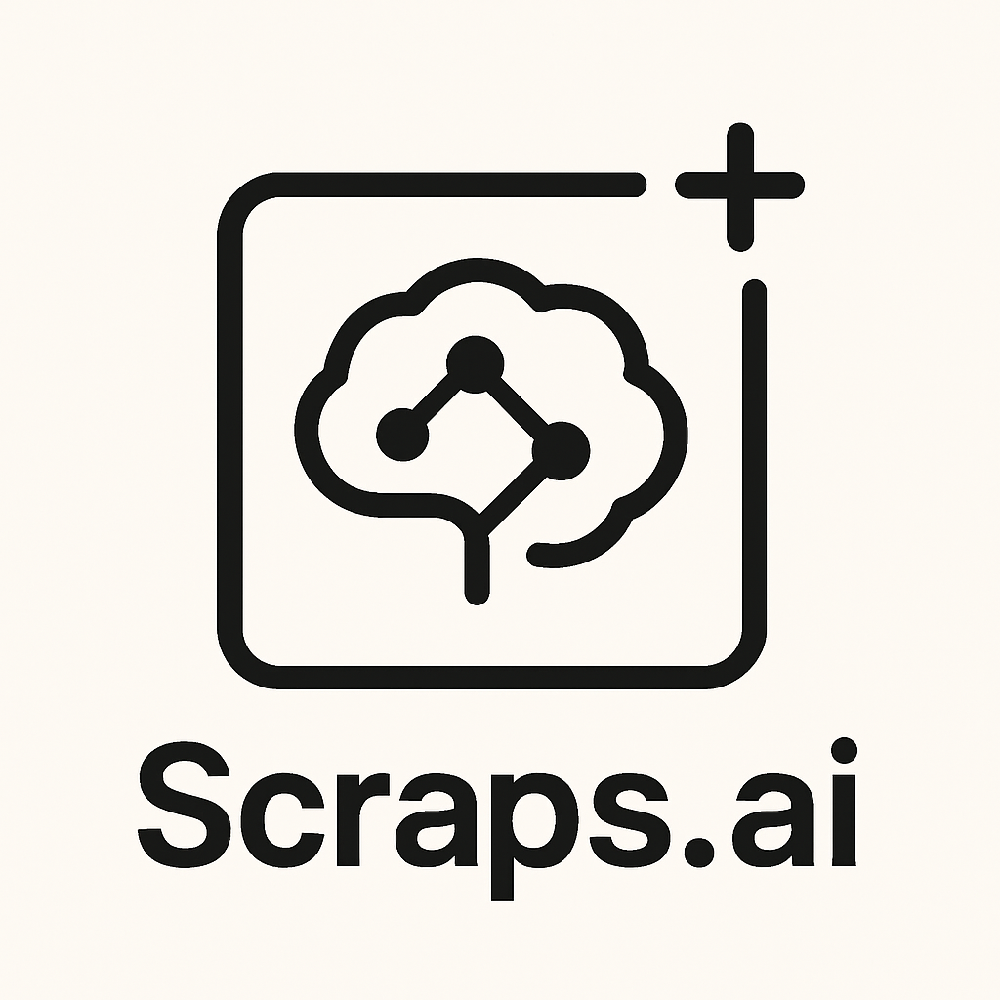

<div align="center">
  <br>
  <span style="font-size:2.5em; font-weight:bold;">Scraps.ai</span>
</div>

## Table of Contents
- [Features](#features)
- [Installation](#installation)
- [Configuration](#configuration)
- [Troubleshooting](#troubleshooting)
- [Extension Development](#extension-development)
  - [Directory Structure](#directory-structure)
  - [Requirements](#requirements)
  - [Setup](#setup)
  - [Building the Extension](#building-the-extension)
  - [Running the Extension](#running-the-extension)
  - [Using the Extension](#using-the-extension)
- [Contributing](#contributing)
- [License](#license)
- [Acknowledgments](#acknowledgments)
- [Contact](#contact)

## Introduction

**Scraps.ai** is an AI-powered note-taking extension for VSCode that helps you organize and structure your notes intelligently, and synchronize your notes to Notion with ease.

## Features

- 📝 Quick note-taking in VSCode sidebar
- 🤖 AI-powered note summarization and structuring
- 🔄 Seamless Notion integration
- 🎯 Multiple AI model support (GPT4, Gemini, Fireworks AI)
- 📱 Cross-device sync

## Installation

- **VS Code/ Cursor Marketplace:**
  1. Open Extensions view (`Cmd+Shift+X`)
  2. Search for `Scraps.ai`(`Franky123.scraps-ai`)
  3. Click **Install**
  4. (If not visible, wait a few minutes or restart the editor)

- **Manual (VSIX):**
  1. Download the latest `.vsix` from [Marketplace](https://marketplace.visualstudio.com/items?itemName=Franky123.scraps-ai)
  2. Open Command Palette (`Cmd+Shift+P`)
  3. Run `Extensions: Install from VSIX...`
  4. Select the downloaded file

## Configuration

To access settings, click on the Scraps.ai icon in the VSCode sidebar and navigate to the Settings tab.

<div align="center">
  
</div>

### AI Settings
- Choose your preferred AI model
- Add your API key for the selected provider
- Customize summarization behavior

### Notion Integration
- Add your Notion API key
- Specify your target database ID
- Enable automatic sync

## How to Use

1. Click **Add** to create a new note.

2. Select a note to edit its content in the editor panel below.

3. Use **Sync Now** to synchronize your notes with Notion.

4. When the synchronization status turns to "Scraps:success" (at the bottom-left corner), you will be able to see the summarized notes as new Notion pages on Notion.

Tip: Make sure your Notion and AI settings are configured before syncing.

## Troubleshooting

If you're unable to edit notes:
- Ensure all dependencies are properly installed
- Make sure both the webview UI and extension are compiled
- Check that the editor panel is visible alongside the list panel

Or you can contact Frank (see contact information at the end)

## Extension Development

### Directory Structure

```plaintext
.
├── resources  ... Static resources for VSCode extension
├── src        ... Source code for VSCode extension
└── webview-ui ... Webview UI source code
    ├── public ... Static resources for Webview UI
    └── src    ... Source code for Webview UI
```

### Requirements

- Node.js
- Visual Studio Code

### Setup

1. Fork this repository
2. Clone the forked repository
3. Install dependencies:
   ```
   npm install
   cd webview-ui
   npm install
   cd ..
   ```

### Building the Extension

```
npm run webview-ui:compile
npm run compile
```

### Running the Extension

There are multiple ways to run the extension:

#### Option 1: Using VSCode Debug Menu
1. Open the project in VSCode
2. Press `F5` or select `Run > Start Debugging` from the menu
3. A new VSCode window will open with the extension loaded
4. Find and click the `Scraps` icon in the activity bar (sidebar)

#### Option 2: Command Line
```
code --extensionDevelopmentPath="[path-to-project-directory]"
```
Replace `[path-to-project-directory]` with the actual path, or use `${PWD}` if running from the project root.

### Using the Extension

1. **Configure Settings First**
   - Open the Scraps.ai sidebar in VSCode.
   - Go to the **Settings** section.

2. **Set Up Notion Integration**
   - Enter your Notion **API Key** (get it from [Notion integrations](https://www.notion.so/my-integrations)).
   - Enter your Notion **Database ID** (find it in your Notion database URL).
   - Click **Save Settings**.

3. **Set Up AI Integration**
   - Enter your AI provider **API Key** (e.g., OpenAI, Google Gemini, Fireworks).
   - Select your preferred AI model from the dropdown.
   - Click **Save Settings**.

4. **Test Connections**
   - Use **Test Connection** to verify your Notion and AI settings.
   - Use **Test AI** to check if the AI summarization is working.

5. **Add and Manage Notes**
   - Click the **Add** button to create a new note.
   - Click on a note in the list to edit it in the editor panel.
   - Right-click a note to rename or delete it.

6. **Sync Notes**
   - Click **Sync Now** to manually synchronize your notes with Notion.
   - Notes will be formatted and summarized using your selected AI model before syncing.

## Contributing

Scraps.ai is open-source and welcomes contributions!

If you have ideas, suggestions, or want to help improve the extension, feel free to open issues or submit pull requests.
https://github.com/FrankLi123/scraps.ai

## License

[MIT License](LICENSE)

## Acknowledgments

This project is a fork of [scraps](https://github.com/corrupt952/scraps), created by K@zuki.
Special thanks to:
- K@zuki
- corrupt952 (GitHub)

## Contact

- Email: zoli@ucsd.edu
- GitHub: [FrankLi123](https://github.com/FrankLi123)
- X (Twitter): [@FrankYouChill](https://x.com/FrankYouChill)
